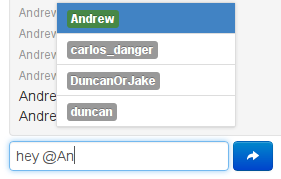

meteor-autocomplete [](https://travis-ci.org/mizzao/meteor-autocomplete)
===================

Client/server autocompletion designed for Meteor's collections and reactivity.

Check out a demo app at http://autocomplete.meteor.com or the [source](examples/pubsublocal).

Help keep your favorite Meteor packages alive! If you depend on this package in your app and find it useful, consider a donation at [Gittip](https://www.gittip.com/mizzao/) for me (or other Meteor package maintainers).

## What's this do?

Auto-completes typing in text `input`s or `textarea`s from different local or remote Meteor collections when triggered by certain symbols. You've probably seen this when referring to users or issues in a GitHub conversation. For example, you may want to ping a user:



...and ask them to look at a certain item:


Features:
 - Multiple collection matching with different trigger tokens and fields
 - Fully live and reactive Meteor template rendering of drop-down list items
 - Drop-down can be positioned above or below the text
 - Mouse or keyboard interaction with autocomplete menu
 - Simple token-less autocompletion in an `<input>` element, just like Bootstrap typeahead

Meteor's client-side data availability makes this dynamic, full-fledged autocomplete widget possible. Use it in chat rooms, comments, other messaging systems, or wherever strikes your fancy.

## Usage

Use Meteor to install the package:

```
meteor add mizzao:autocomplete
```

Add a text `input` or `textarea` to a template in one of the following ways, as a Spacebars template or block helper. Pass in any HTML parameters as other arguments to the template:

```
<template name="foo">
    ... stuff
    {{> inputAutocomplete settings=settings id="msg" class="input-xlarge" placeholder="Chat..."}}
    ... more stuff
</template>

<template name="bar">
    ... stuff
    {{#textareaAutocomplete settings=settings id="msg"}}
        {{myStartingText}}
    {{/textareaAutocomplete}}
    ... more stuff
</template>
```

Define a helper for the first argument, like the following example:

```javascript
Template.foo.helpers({
  settings: function() {
    return {
      position: "top",
      limit: 5,
      rules: [
        {
          token: '@',
          collection: Meteor.users,
          field: "username",
          template: Template.userPill
        },
        {
          token: '!',
          collection: Dataset,
          field: "_id",
          options: '',
          matchAll: true,
          filter: { type: "autocomplete" },
          template: Template.dataPiece
        }
      ]
    };
  }
});
```

##### Top Level Options

- `position` (= `top` or `bottom`) specifies if the autocomplete menu should render above or below the cursor. Select based on the placement of your `input`/`textarea` relative to other elements on the page.
- `limit`: Controls how big the autocomplete menu should get.
- `rules`: An array of matching rules for the autocomplete widget, which will be checked in order.

##### Rule Specific Options

- `token`: (optional) What character should trigger this rule. Leave blank for whole-field behavior (see below).
- `collection`: What collection should be used to match for this rule. Must be a `Mongo.Collection` for client-side collections, or a string for remote collections (available in `global` on the server.)
- `subscription`: A custom subscription for server-side search; see below.
- `template`: The template that should be used to render each list item.
- `filter`: (optional) An object that will be merged with the autocomplete selector to limit the results to more specific documents in the collection.
- `sort`: (default `false`) Whether to sort the results before applying the limit. For good performance on large collections, this should be turned on only for server-side searches where an index can be used.
- `noMatchTemplate`: (optional) A template to display when nothing matches. This template can use the [reactive functions on the AutoComplete object](autocomplete-client.coffee) to display a specific message, or be [assigned mouse/keyboard events](http://docs.meteor.com/#eventmaps) for user interaction.

Default matcher arguments: the default behavior is to create a regex against the field to be matched, which will be constructed using the arguments below.

- `field`: The field of the collection that the rule will match against. Can be nested, i.e. `'profile.foo'`.
- `options`: `'i'` (default) to specify the regex matching options.
- `matchAll`: `false` (default) to match only fields starting with the matched string. (see below)

Custom matcher: if this is specified, the *default* matcher arguments will be ignored. (Note that you should still specify `field`.)

- `selector`: a one argument `function(match)` that takes the currently matched token suffix and returns the selector that should be added to the argument to `collection.find` to filter the autocomplete results. (**NOTE**: if you are using `$where`, the selector cannot be serialized to the server).

##### Detecting Selections

Autocomplete triggers jQuery events that can be listened to using Meteor's event maps. The only currently supported event is `autocompleteselect`, which notifies of a selected element. For example:

```
Template.foo.events({
  "autocompleteselect input": function(event, template, doc) {
    console.log("selected ", doc);
  }
});
```

See the example app for more details.

##### Regex Specification and Options

Note that [regular expression searches](http://docs.mongodb.org/manual/reference/operator/query/regex/) can only use an index efficiently when the regular expression has an anchor for the beginning (i.e. `^`) of a string and is a case-sensitive match. Hence, when using case-sensitive matches and string start anchors (i.e. `matchAll: false`) searches can take advantage of server indices in Mongo.

This behavior is demonstrated in the example app.

##### Whole-field (Tokenless) Autocompletion

If you only need to autocomplete over a single collection and want to match the entire field, specify a `rules` array with a single object and omit the `token` argument. The behavior for this is a little different than with tokens; see the [demo](http://autocomplete.meteor.com).

Mixing tokens with tokenless autocompletion is unsupported and will probably result in unexpected behavior.

##### Server-side Autocompletion and Text Search Engines

For security purposes, a default implementation of server-side autocomplete is only provided for insecure collections, to be used while prototyping. In all other applications, write your own publish function with the same arguments as in the [autocomplete-recordset](autocomplete-server.coffee) publication and secure it properly, given that malicious clients can subscribe to this function in ways other than the autocomplete client code would.

Make sure to push documents to the `autocompleteRecords` client-side collection. A convenience function, `Autocomplete.publishCursor`, is provided as an easy way to do this. See the default implementation for an example.

Use of a custom publish function also allows you to:

* use full-text search services outside of Meteor, such as [ElasticSearch](http://www.elasticsearch.org/)
* use [preferential matching](https://github.com/mizzao/meteor-autocomplete/blob/a437c7b464ad9e779da2ca15566a5b91cf603902/autocomplete-server.coffee) for record fields that start with the autocomplete text, rather than contain it anywhere

##### Autocomplete Templates

An autocomplete template is just a normal Meteor template that is passed in the matched document. The template will be passed the entire matched document as a data context, so render list items as fancily as you would like. For example, it's usually helpful to see metadata for matches as in the pictures above.

Records that match the filter text typed after the token render a list of the `template` sorted in ascending order by `field`. For example, if you were matching on `Meteor.users` and you just wanted to display the username, you can do something very simple, and display the same field:

```
<template name="userPill">
    <span class="label">{{username}}</span>
</template>
```

However, you might want to do something a little more fancy and show not only the user, but whether they are online or not (with something like the [user-status](https://github.com/mizzao/meteor-user-status) package. In that case you could do something like the following:

```
<template name="userPill">
    <span class="label {{labelClass}}">{{username}}</span>
</template>
```

and accompanying code:

```javascript
Template.userPill.labelClass = function() {
  if this._id === Meteor.userId()
    return "label-warning"
  else if this.profile.online === true
    return "label-success"
  else
    return ""
}
```

This (using normal Bootstrap classes) will cause the user to show up in orange for him/herself, in green for other users that are online, and in grey otherwise. See [CrowdMapper's templates](https://github.com/mizzao/CrowdMapper/blob/master/client/views/common.html) for other interesting things you may want to do.

##### Examples

For example settings see one of the following:

- [Multi-field example](examples/pubsublocal/client/client.js) (from the app above)
- [Single-field example](examples/pubsublocal/client/single.js) (also from the app above)
- [Autocompleting chatroom example](https://github.com/mizzao/CrowdMapper/blob/master/client/views/chat.coffee)

### Future Work (a.k.a. send pull requests)

- To reduce latency, we could additionally support using `Meteor.methods` to return an array of documents, instead of a subscription, if the client's cache of the collection is assumed to be read-only or if changes don't matter.
- The widget can keep track of a list of ordered document ids for matched items instead of just spitting out the fields (which currently should be unique)
- Could potentially support rendering DOM elements instead of just text. However, this can currently be managed in post-processing code for chat/post functions (like how GitHub does it).

### Credits/Notes

- If you are not using Meteor, you may want to check out [jquery sew](https://github.com/tactivos/jquery-sew), from which this was heavily modified.
- If you need tag autocompletion only (from one collection, and no text), try either the [x-editable smart package](https://github.com/nate-strauser/meteor-x-editable-bootstrap) with Select2 or [jquery-tokenInput](http://loopj.com/jquery-tokeninput/). Those support rendering DOM elements in the input field.

### Main Contributors

- Andrew Mao ([mizzao](https://github.com/mizzao))
- Dan Dascalescu ([dandv](https://github.com/dandv))
- Adam Love ([Neobii](https://github.com/Neobii))

